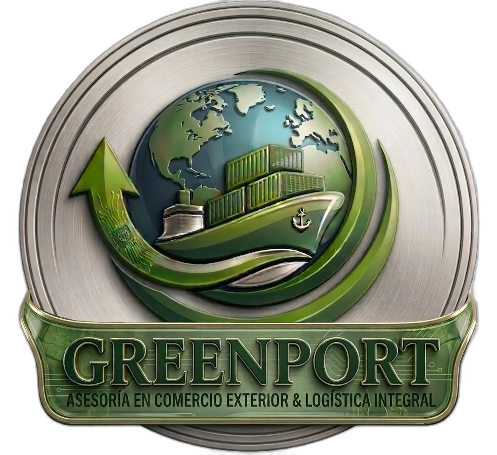

# GREENPORT — Asesoría de Comercio Exterior y Logística 4PL



Landing page premium para **GREENPORT**, operador logístico 4PL integral con alianza estratégica con TODOCOMEX.

## 🚀 Stack Tecnológico

- **HTML5** — Estructura semántica SEO-optimizada
- **Tailwind CSS** (CDN) — Utilidades de layout
- **CSS Custom** — Tema Mercedes AMG F1 (Petronas Teal + Carbon Black)
- **JavaScript Vanilla** — Interactividad (acordeones, menú móvil, scroll effects)
- **Font Awesome 6** — Iconografía
- **Google Fonts** — Inter + Montserrat

## 📂 Estructura del Proyecto

```
greenport-logistica-web/
├── index.html                              # Landing page principal
├── assets/                                 # Imágenes optimizadas (WebP)
│   ├── logo_transparente.webp              # Logo Greenport (~139 KB)
│   ├── logo_todocomex_nuevo_transparente.webp  # Logo Todocomex (~82 KB)
│   ├── logo_nuevo.webp                     # Logo alternativo (~133 KB)
│   ├── logo_todocomex.webp                 # Logo Todocomex alt (~24 KB)
│   └── logo_todocomex_transparente.webp    # Logo Todocomex trans (~47 KB)
├── logo_transparente.png                   # Original PNG (referencia/fallback)
├── logo_todocomex_nuevo_transparente.png   # Original PNG
├── logo_nuevo.png                          # Original PNG
├── logo_todocomex.png                      # Original PNG
├── logo_todocomex_transparente.png         # Original PNG
├── .gitignore
└── README.md
```

## ✨ Características

- **Diseño Premium** con glassmorphism, gradientes y micro-animaciones
- **Responsive** — Adaptado a móvil, tablet y desktop
- **Menú móvil** con overlay full-screen
- **Acordeones interactivos** en sección de Servicios y FAQ
- **Botón WhatsApp** flotante con enlace directo
- **Formulario de contacto** con campos validados
- **SEO optimizado** con meta tags, Open Graph y estructura semántica

## 🌐 Deploy

Actualmente desplegado en: [greenport-logistica-test.netlify.app](https://greenport-logistica-test.netlify.app)

## 📞 Contacto

- **Teléfono:** +56 9 7806 4517
- **Email:** contacto@greenport.cl
- **Dirección:** Cochrane 639 oficina 78, Edificio Puerto Principal, Valparaíso

---

© 2026 GREENPORT Asesoría de Comercio Exterior. Todos los derechos reservados.
